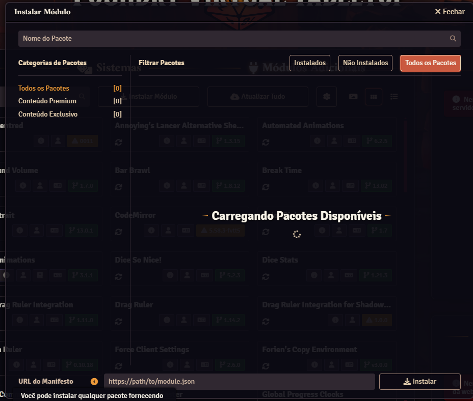

# Tradução Compendium Shadowdark - Português (Brasil)
<b>Módulo de tradução 1 pra 1 do compêndio de Shadowdark com o livro oficial utilizando o módulo Babele.</b>
<b>Foi traduzido totalmente o compêndio Conditions, Gear, e todos os nomes de magias do livro base. Estou no processo de tradução das descrições das magias.</b>

# Como Usar
- Instale o Sistema Shadowdark no Foundry. (Testei apenas na v12)
- Instale o módulo Babele e esse módulo.
- Ative ambos.
- Altere o idioma em configurações para Português (Brasil)

# Como instalar
- Vá em Módulos adicionais > Instalar Módulo > Cole na URL do Manifesto na parte inferior a seguinte url: "https://raw.githubusercontent.com/renanb4/traducao-compendium-shadowdark-ptbr/refs/heads/main/module.json"

# Onde Obter
- Comprar os materiais em Português (Brasil): https://www.catarse.me/shadowdark

# Credits/License   
This work is based on Shadowdark (found at https://www.thearcanelibrary.com/pages/shadowdark)
